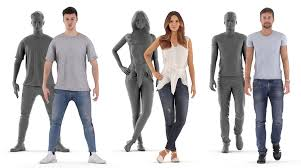

Este proyecto consistirá en una pagina web que permitirá al usuario escanear objetos y/o personas para, poder así, visualizar su modelo 3D en el dispositivo.

## Descripcion del proyecto

El proyecto se basa en la creacion de una imagen 3D de la persona u objeto que sera escaneado previamente mediante fotos/videos para que podamos moldear
Imagen de demostracion:

-   Escaneando silla con la camara. <br>
    

-   Personas posiblemente escaneadas con camara o videos. <br>
    

## Inspiracion del proyecto

El estado del arte Gaussian Splating es una tecnica que se utiliza para la creacion de modelos 3D a partir de imagenes 2D, en este caso se utilizara para la creacion de modelos 3D de personas y objetos a partir de imagenes 2D, la herramienta coolmap nos servira para la creacion de los modelos 3D.
Luego de tener el modelo 3D se podra visualizar en el dispositivo, podemos generar su visualizacion en 3D y poder manipularlo, para usarlo en la creacion de videojuegos, animaciones, etc.

## Herramientas a utilizar

-   [Coolmap](https://colmap.github.io/install.html#mac)
-   [Python](https://www.python.org/downloads/)
-   [OpenCV](https://pypi.org/project/opencv-python/)
-   [Numpy](https://pypi.org/project/numpy/)
-   [Pandas](https://pypi.org/project/pandas/)
-   [Matplotlib](https://pypi.org/project/matplotlib/)

## Instalacion de herramientas

-   Instalacion de Coolmap
    ```bash
    git clone https://github.com/colmap/colmap.git
    cd colmap
    ```

## Integrantes

-   Matias Fabricio Maravi Anyosa
-   Leonardo Daniel Isidro Salazar
-   Jerimy Pierre Sandoval Rivera
-   Alejandro Gerardo Calizaya Alvarez
