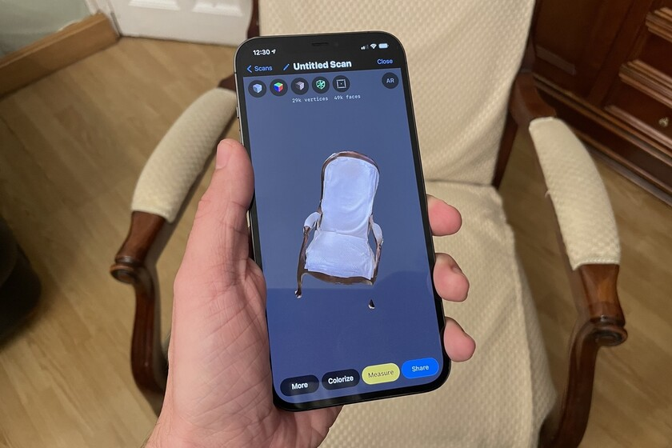

# RealScan3D

Proyecto de computación gráfica

## Descripcion del proyecto

El proyecto se basa en la creacion de una imagen 3D de la persona u objeto que sera escaneado previamente mediante fotos/videos para que podamos moldear
Imagen de demostracion:

-   Escaneando silla con fotos de camara
    []
-   Personas posiblemente escaneadas con camara o videos
    []

## Integrantes

-   Matias Maravi Anyosa
-   Leonardo Isidro Salazar
-   Jerimy Sandoval Rivera
-   Alejandro Calizaya Alvarez
